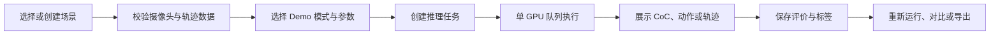
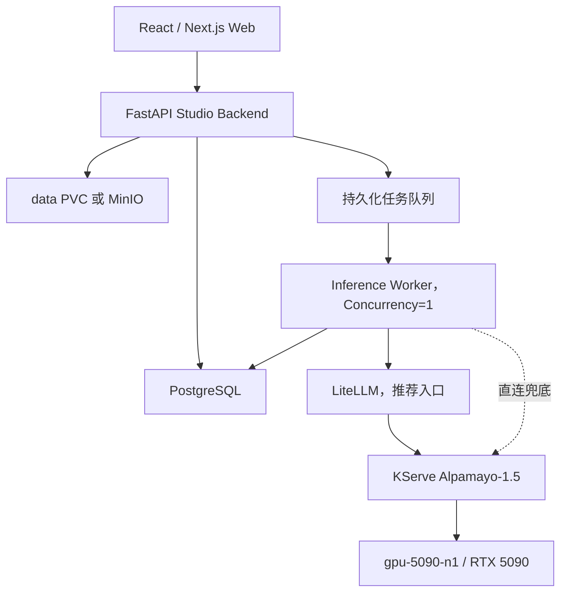

# Alpamayo Web Studio 产品需求文档（PRD）

| 字段 | 内容 |
| --- | --- |
| 文档版本 | v0.2 |
| 文档状态 | Ready for Development |
| 产品名称 | Alpamayo Web Studio |
| 目标模型 | NVIDIA Alpamayo-1.5-10B |
| 目标环境 | Kubernetes，`loshu` Namespace |
| 推理节点 | `gpu-5090-n1` |
| 更新时间 | 2026-08-09 |

## 1. 产品概述

Alpamayo Web Studio 是面向自动驾驶研发、算法评测和数据标注人员的场景推理工作台。用户可以导入多摄像头时序画面、车辆历史轨迹和导航指令，调用已部署的 Alpamayo 模型，查看驾驶场景问答、Chain-of-Causation（CoC）推理、Meta Action 和未来 6.4 秒轨迹预测。

产品由一个共享平台和六个 Demo 模式组成：

1. Scene Workbench：场景推理工作台
2. Navigation Lab：导航指令轨迹实验室
3. Camera Ablation：多摄像头消融实验
4. Scene VQA：驾驶场景视觉问答
5. Auto Label Studio：CoC 自动标注工作室
6. Regression & Judge：回归评测与 Judge Lab

六个 Demo 共用场景库、模型网关、推理任务队列、结果存储和可视化组件，不构建六套独立应用。

## 2. 背景与现状

Alpamayo-1.5-10B 已部署完成：

- KServe 服务：`alpamayo-1-5`
- 部署模式：`RawDeployment`
- 集群内服务：`http://alpamayo-1-5-predictor.loshu.svc.cluster.local`
- 推理接口：`POST /v1/models/alpamayo-1-5:predict`
- 模型路径：`/model/Alpamayo-1.5-10B`
- 运行精度：BF16
- GPU：单张 NVIDIA RTX 5090 32GB
- 空载模型显存约 21.65GiB
- 服务并发：1
- 已通过模型加载、健康检查和 VQA 端到端推理验证

当前缺少面向业务用户的输入组织、任务排队、结果可视化、场景持久化、人工审核和回归对比能力。

## 3. 产品目标

### 3.1 核心目标

- 让非模型工程人员可以在浏览器中完成一次 Alpamayo 场景推理。
- 将多摄像头画面、CoC、Meta Action 和预测轨迹放在同一上下文中展示。
- 将一次性推理升级为可保存、可复现、可对比的场景案例。
- 为后续自动标注、模型升级回归和 teacher/student 评测建立共享底座。
- 形成适合演示、内部评审和快速二次开发的 Web 产品。

### 3.2 首版成功指标

- 新用户在 5 分钟内完成首次场景推理。
- 单场景推理任务成功率不低于 95%（不含非法输入）。
- 每个任务完整记录输入、参数、模型版本、输出、耗时和错误。
- 相同场景可以一键重新运行和进行结果对比。
- 六个 Demo 均可从同一场景库进入，无需重复上传数据。
- UI 不直接暴露 Kubernetes 内部模型地址。

### 3.3 非目标

- 不作为车辆实时控制系统。
- 不提供汽车安全认证或量产决策能力。
- 首版不实现闭环仿真、传感器仿真或车辆动力学仿真。
- 首版不训练或微调 Alpamayo。
- 首版不支持多用户同时占用多个 GPU 推理实例。
- 不将 CoC 或预测轨迹解释为经过安全认证的驾驶结论。

## 4. 目标用户

### 4.1 算法工程师

关注输入配置、推理参数、CoC、轨迹、可复现性和模型版本差异。

### 4.2 数据与标注工程师

关注场景标签、自动生成结果、人工审核、修改、接受或驳回以及数据导出。

### 4.3 测试与评测工程师

关注场景集合、批量运行、成功率、差异指标、失败案例和回归报告。

### 4.4 产品与演示人员

关注低门槛操作、清晰可视化、预置样例和稳定的演示流程。

## 5. 产品信息架构

```text
Alpamayo Web Studio
├── Overview                 产品状态与最近任务
├── Scene Library            场景库
├── Scene Workbench          场景推理工作台
├── Navigation Lab           导航指令实验
├── Camera Ablation          摄像头消融
├── Scene VQA                场景问答
├── Auto Label Studio        自动标注
├── Regression & Judge       回归评测
└── Settings                 模型、存储和系统设置
```

## 6. 核心用户流程



## 7. 共享场景规范

### 7.1 摄像头定义

| Camera ID | 显示名称 | 首版支持 |
| --- | --- | --- |
| 0 | Front Left | 是 |
| 1 | Front | 是 |
| 2 | Front Right | 是 |
| 3 | Rear Left | 是 |
| 4 | Rear | 是 |
| 5 | Rear Right | 是 |
| 6 | Front Telephoto | 是 |

推荐默认场景使用 `0、1、2、6` 四路摄像头，每路 4 帧。系统也允许 1～7 路摄像头，但必须明确提示摄像头减少可能影响结果质量。

### 7.2 场景输入

- 场景名称和可选描述
- 摄像头列表
- 每路 1～8 帧图片；推荐 4 帧
- 同一任务中所有摄像头帧数必须相同
- 支持 JPEG 和 PNG
- 导航指令，可选
- 车辆历史位置：`[16, 3]`
- 车辆历史旋转矩阵：`[16, 3, 3]`
- 标签、数据来源和备注，可选

如果历史轨迹缺失，允许使用静止车辆默认值运行，但页面必须显示醒目警告，结果不得默认进入“已审核”状态。

### 7.3 场景输出

- VQA Answer
- Chain-of-Causation
- Meta Action
- 未来轨迹 XYZ
- 未来旋转矩阵
- 模型名称和版本
- 推理参数与随机种子
- 排队时间、推理耗时和总耗时
- 原始响应和错误信息

轨迹按模型输出的 64 个未来时间点展示，时间步长 0.1 秒，总时域 6.4 秒。

## 8. Demo 1：Scene Workbench

### 8.1 目标

建立整个产品的基础场景查看与推理界面，后续五个 Demo 复用其组件。

### 8.2 功能需求

- 从场景库选择场景或新建场景。
- 支持拖拽上传多摄像头图片。
- 按 Camera ID 自动排序。
- 提供同步帧时间轴；切换时间点时所有摄像头同步变化。
- 输入导航指令和历史轨迹。
- 配置 seed、temperature、top-p、生成长度和轨迹样本数。
- 提交轨迹推理任务。
- 展示任务状态：等待、运行、成功、失败、取消。
- 展示 CoC、Meta Action、预测轨迹和原始 JSON。
- 支持下载结果 JSON。
- 支持保存为场景案例和一键重新运行。

### 8.3 页面布局

```text
┌──────────────┬──────────────────────────────────────┐
│ 场景库        │ 多摄像头画面                        │
│ 搜索/标签     │ Camera 0 | Camera 1 | Camera 2 | 6 │
│ 最近运行      ├──────────────────────────────────────┤
│              │ 时间轴与导航指令                    │
│              ├───────────────────┬──────────────────┤
│              │ BEV 轨迹图         │ CoC / Meta Action│
│              ├───────────────────┴──────────────────┤
│              │ 推理参数、任务状态、评价和导出       │
└──────────────┴──────────────────────────────────────┘
```

### 8.4 验收标准

- 四路摄像头 × 四帧场景可以成功提交。
- 页面正确展示 64 个未来轨迹点。
- CoC 和 Meta Action 支持复制与展开查看。
- 页面刷新后仍可恢复任务和结果。
- 重复提交不会覆盖历史结果。

## 9. Demo 2：Navigation Lab

### 9.1 目标

直观展示同一视觉场景在不同导航指令下的轨迹和推理差异。

### 9.2 功能需求

- 从一个基础场景创建 2～4 个导航实验分支。
- 内置导航模板：继续直行、左转、右转、靠左、靠右、用户自定义。
- 使用相同 seed 或独立 seed 运行。
- 并排展示不同指令下的 CoC 和 Meta Action。
- 在同一 BEV 坐标系叠加不同颜色轨迹。
- 显示轨迹终点差、平均点位差和最大横向差。
- 将对比结果保存为实验。

### 9.3 验收标准

- 至少支持三组导航指令串行排队执行。
- 图例能够明确对应导航指令和轨迹颜色。
- 可以隐藏或显示任意实验分支。
- 对比结果可以导出为 JSON 和 PNG。

## 10. Demo 3：Camera Ablation

### 10.1 目标

分析摄像头数量和组合对模型推理与轨迹预测的影响。

### 10.2 功能需求

- 从完整场景选择摄像头组合。
- 提供预置组合：仅前视、前向三摄、标准四摄、全部摄像头。
- 对不同组合执行相同参数推理。
- 并排展示 CoC、Meta Action 和轨迹。
- 计算与基准组合的轨迹差异。
- 标记可能因视野缺失导致的风险，例如右转时缺少侧向摄像头。

### 10.3 验收标准

- 用户可以在不重新上传数据的情况下创建消融任务。
- 系统准确记录每次运行使用的 Camera ID。
- BEV 中可以同时叠加基准和消融轨迹。
- 报告明确显示摄像头组合，不只显示实验名称。

## 11. Demo 4：Scene VQA

### 11.1 目标

让用户针对驾驶场景进行自然语言提问，验证模型对场景关系和风险的理解。

### 11.2 功能需求

- 输入自然语言问题。
- 提供问题模板：
  - 前方是否有行人或障碍物？
  - 当前是否适合左转或右转？
  - 哪个交通参与者最需要关注？
  - 交通灯或道路标志是什么状态？
  - 画面中存在什么潜在风险？
- 支持连续创建多个独立问题。
- 显示回答、输入摄像头和生成参数。
- 支持用户评分：正确、部分正确、错误、无法判断。
- 支持添加审核备注。

### 11.3 验收标准

- 单张或多摄像头图片均可提交 VQA。
- 每个问题生成独立结果记录。
- 回答可以复制和导出。
- 用户评价和备注在刷新后保留。

## 12. Demo 5：Auto Label Studio

### 12.1 目标

利用 Alpamayo 生成场景级 CoC、驾驶动作和风险标签，并通过人工审核形成可用标注。

### 12.2 功能需求

- 从场景推理结果生成候选标签。
- 首版标签类别：
  - 道路结构
  - 交通参与者
  - 潜在风险
  - 导航意图
  - Meta Action
  - 长尾场景类型
- 自动标签状态：待审核、已接受、已修改、已驳回。
- 允许审核人员编辑标签和 CoC 摘要。
- 保存模型原始输出与人工修订结果，禁止覆盖原始输出。
- 支持筛选待审核场景。
- 支持导出 JSONL。

### 12.3 验收标准

- 原始模型输出和人工结果可追溯。
- 每次审核记录操作者、时间和修改内容。
- 可以按标签、状态和时间筛选。
- 导出的 JSONL 包含场景 ID、模型版本和审核状态。

## 13. Demo 6：Regression & Judge

### 13.1 目标

为模型、参数或服务版本变化提供可重复的场景回归测试和结果评判能力。

### 13.2 功能需求

- 创建由多个场景组成的测试集。
- 为测试集创建运行批次。
- 首版按单 GPU 顺序执行，禁止并发压垮模型服务。
- 比较不同运行批次的：
  - 成功率
  - 推理耗时
  - CoC 文本差异
  - Meta Action 一致性
  - 轨迹平均点位差
  - 轨迹终点差
- 支持人工 Judge 评分。
- 预留自动 Judge 接口，可后续接入 teacher 模型。
- 标记改善、持平、退化和需要人工检查。
- 生成可分享的回归报告。

### 13.3 验收标准

- 至少支持 10 个场景的顺序批量运行。
- 单个场景失败不终止整个批次。
- 可以从报告跳转到对应场景和两次原始输出。
- 所有指标都能追溯到模型版本和推理参数。

## 14. 共享功能需求

### 14.1 场景库

- 场景创建、编辑、复制和归档。
- 按名称、Camera ID、标签、来源和时间搜索。
- 显示数据完整性状态。
- 场景删除首版采用软删除。
- 同一文件使用内容哈希去重。

### 14.2 推理任务队列

- 所有模型请求进入持久化队列。
- 当前模型服务同时只运行一个任务。
- 展示队列位置和任务状态。
- 支持取消尚未开始的任务。
- 任务失败记录 HTTP 状态码、错误正文和重试次数。
- 默认不自动重试模型 OOM；由用户确认后重新运行。

### 14.3 结果与版本

- 每次运行生成不可变 run ID。
- 保存模型服务名、模型版本、参数、输入场景版本和代码版本。
- 人工评价单独版本化，不覆盖模型响应。
- 支持原始 JSON 下载。

### 14.4 系统状态

- 展示 Alpamayo Ready 状态。
- 展示当前运行任务和等待数量。
- 展示最近错误，但不向普通用户暴露 Kubernetes Secret。
- 管理员可查看服务地址、Pod 和 GPU 摘要。

## 15. 数据模型

### 15.1 核心实体

| 实体 | 说明 |
| --- | --- |
| Scene | 场景基础信息和当前版本 |
| SceneVersion | 不可变的摄像头、轨迹和导航输入快照 |
| CameraSequence | 一个 Camera ID 对应的时序帧集合 |
| InferenceRun | 一次模型运行及其参数和状态 |
| InferenceResult | 模型原始结果和结构化结果 |
| Annotation | 自动标签和人工审核结果 |
| Experiment | 导航或摄像头消融实验 |
| EvaluationSet | 回归测试场景集合 |
| EvaluationRun | 一次回归批次 |
| Review | 人工评分、判断和备注 |

### 15.2 场景 API 示例

```json
{
  "name": "urban-right-turn-001",
  "description": "城市路口右转场景",
  "navigation": "Turn right at the intersection",
  "cameras": [
    {
      "camera_index": 0,
      "frames": ["asset://frame-0", "asset://frame-1", "asset://frame-2", "asset://frame-3"]
    },
    {
      "camera_index": 1,
      "frames": ["asset://frame-0", "asset://frame-1", "asset://frame-2", "asset://frame-3"]
    },
    {
      "camera_index": 2,
      "frames": ["asset://frame-0", "asset://frame-1", "asset://frame-2", "asset://frame-3"]
    },
    {
      "camera_index": 6,
      "frames": ["asset://frame-0", "asset://frame-1", "asset://frame-2", "asset://frame-3"]
    }
  ],
  "ego_history_xyz": [[0.0, 0.0, 0.0]],
  "ego_history_rot": [[[1.0, 0.0, 0.0], [0.0, 1.0, 0.0], [0.0, 0.0, 1.0]]],
  "tags": ["urban", "intersection", "right-turn"]
}
```

实际提交时，`ego_history_xyz` 必须包含 16 行，`ego_history_rot` 必须包含 16 个旋转矩阵。示例为展示结构而缩短。

## 16. Web Studio Backend API

前端只调用 Web Studio Backend，不直接调用 KServe。

| 方法 | 路径 | 说明 |
| --- | --- | --- |
| GET | `/api/health` | Studio 健康状态 |
| GET | `/api/model/status` | Alpamayo 状态摘要 |
| POST | `/api/assets` | 上传图片或场景资产 |
| POST | `/api/scenes` | 创建场景 |
| GET | `/api/scenes` | 搜索场景 |
| GET | `/api/scenes/{id}` | 获取场景详情 |
| POST | `/api/scenes/{id}/runs` | 创建推理任务 |
| GET | `/api/runs/{id}` | 获取任务和结果 |
| POST | `/api/runs/{id}/cancel` | 取消排队任务 |
| POST | `/api/runs/{id}/reviews` | 保存人工评价 |
| POST | `/api/experiments` | 创建导航或消融实验 |
| POST | `/api/evaluation-sets` | 创建回归测试集 |
| POST | `/api/evaluation-runs` | 创建回归运行批次 |

Backend 负责将资产引用转换为 Alpamayo 当前要求的 base64 请求格式。base64 只存在于 Backend 到 KServe 的内部请求，不写入业务数据库。

## 17. 技术架构约束



### 17.1 推荐实现

- Web：React + Next.js + TypeScript
- UI：现有团队组件库；无统一组件库时采用 Tailwind CSS
- 图形：ECharts 或 Canvas，用于 BEV 和轨迹叠加
- Backend：FastAPI + Pydantic
- 数据库：PostgreSQL
- 任务队列：Redis + RQ/Celery，或具备持久化能力的等价实现
- 场景资产：MVP 可使用 `data` RWX PVC；后续切换 MinIO
- 部署：Kubernetes Deployment + Service
- 模型调用：优先通过 LiteLLM 的 OpenAI 兼容接口；LiteLLM 不可用时，通过集群内 KServe Service 直连兜底

### 17.2 环境变量

| 变量 | 示例 |
| --- | --- |
| `ALPAMAYO_ACCESS_MODE` | `litellm`，失败时切换为 `direct` |
| `LITELLM_BASE_URL` | `http://litellm-service.loshu-workspace.svc.cluster.local` |
| `LITELLM_MODEL_NAME` | `alpamayo-vqa` |
| `LITELLM_API_KEY` | 由 Kubernetes Secret 注入；当前 Demo 环境未启用强制鉴权，值留空 |
| `ALPAMAYO_DIRECT_BASE_URL` | `http://alpamayo-1-5-predictor.loshu.svc.cluster.local` |
| `ALPAMAYO_DIRECT_MODEL_NAME` | `alpamayo-1-5` |
| `INFERENCE_CONCURRENCY` | `1` |
| `DATABASE_URL` | 由 Kubernetes Secret 提供 |
| `REDIS_URL` | 由 Kubernetes Secret 提供 |
| `ASSET_ROOT` | `/data/alpamayo-web-studio` |

### 17.3 Alpamayo 访问方式及秘钥

Web Studio 前端不得直接访问 LiteLLM、KServe 或保存访问密钥。所有模型请求由 Backend 或 Inference Worker 发起。

#### 方式一：通过 LiteLLM 访问（推荐）

| 配置项 | 当前值 |
| --- | --- |
| 集群内 Base URL | `http://litellm-service.loshu-workspace.svc.cluster.local` |
| 部署测试地址 | 由实际部署环境提供，不写入源码 |
| 模型名 | `alpamayo-vqa` |
| 推理接口 | `POST /v1/chat/completions` |
| 健康检查 | `GET /health/readiness` |
| 模型列表 | `GET /v1/models` |
| 当前鉴权 | 未启用强制鉴权，不需要 API Key |

LiteLLM 已完成以下端到端验证：健康检查返回 HTTP 200；模型列表包含 `alpamayo-vqa`；图片问答请求经 LiteLLM 转发至 Alpamayo 后返回 HTTP 200 和有效回答。

当前 NodePort 仅用于内网联调，不作为浏览器或生产系统的固定地址。Backend 和 Worker 必须使用集群内 Service DNS。

当前 Demo 环境调用示例：

```bash
curl http://litellm-service.loshu-workspace.svc.cluster.local/v1/chat/completions \
  -H 'Content-Type: application/json' \
  -d '{
    "model": "alpamayo-vqa",
    "messages": [{
      "role": "user",
      "content": [
        {"type": "text", "text": "请描述当前道路场景和驾驶风险。"},
        {"type": "image_url", "image_url": {"url": "data:image/jpeg;base64,<IMAGE_BASE64>"}}
      ]
    }],
    "max_tokens": 256,
    "temperature": 0.6
  }'
```

#### 方式二：集群内直连 Alpamayo（兜底）

| 配置项 | 当前值 |
| --- | --- |
| KServe Service | `alpamayo-1-5-predictor` |
| Namespace | `loshu` |
| Base URL | `http://alpamayo-1-5-predictor.loshu.svc.cluster.local` |
| OpenAI 兼容 VQA 接口 | `POST /v1/chat/completions`，模型名为 `alpamayo-vqa` |
| 原生 KServe 接口 | `POST /v1/models/alpamayo-1-5:predict` |
| 就绪检查 | `GET /ready` |
| 当前鉴权 | 无应用层 API Key，由 Kubernetes 集群网络和 Istio AuthorizationPolicy 控制 |

已从 `loshu-workspace` 的实际 Pod 验证跨 Namespace DNS、健康检查和图片问答推理，均返回 HTTP 200。因此 LiteLLM 不可用时，Inference Worker 可以切换到该地址，不依赖 NodePort。

#### 密钥管理要求

- 当前 LiteLLM 未启用强制鉴权，`LITELLM_API_KEY` 必须留空；不得填写占位密钥或在代码中硬编码密钥。
- 生产启用 LiteLLM `master_key` 后，应将密钥保存在 Kubernetes Secret 中，并以 `LITELLM_API_KEY` 环境变量注入 Backend 和 Worker。
- 启用鉴权后，LiteLLM 请求增加 `Authorization: Bearer ${LITELLM_API_KEY}`；切换前必须同步更新所有现有 Qwen 和 Alpamayo 调用方。
- KServe 直连不使用共享 API Key，访问范围由 Istio 和 Kubernetes 网络策略控制。
- Secret、Authorization Header 和完整 base64 图片不得写入前端、PRD、Git 仓库、任务结果或应用日志。
- 正式环境应为 Web Studio 配置独立 ServiceAccount 和 Istio Sidecar，并将当前 Alpamayo 放行策略收紧到指定 Namespace/ServiceAccount。

## 18. 非功能需求

### 18.1 性能与可靠性

- 上传进度必须可见。
- 前端操作不因模型推理阻塞。
- 单任务默认超时 300 秒，可配置。
- Worker 重启后，排队任务不得丢失。
- 服务重启后可以恢复历史结果。
- GPU OOM 时任务失败并释放运行锁。

### 18.2 安全

- 不在前端代码中保存 Kubernetes 地址、Token 或 Secret。
- 上传文件校验 MIME、扩展名和大小。
- 禁止 Backend 根据用户输入访问任意 URL，避免 SSRF。
- 原始场景数据默认仅在集群内部存储。
- 删除采用软删除和管理员二次确认。
- 记录关键操作审计日志。

### 18.3 可观测性

- 记录 request ID、scene ID、run ID 和模型响应耗时。
- 提供结构化日志。
- 暴露 Backend 和 Worker 健康检查。
- 统计任务成功、失败、取消、排队时间和推理耗时。
- 不在日志中输出完整 base64 图片。

### 18.4 浏览器支持

- 优先支持最新 Chrome 和 Edge。
- 最小设计宽度 1280px。
- 第一版以桌面研发工作台为主，不要求移动端完整功能。

## 19. 优先级

### P0：首个可用版本

- 场景创建和四摄像头上传
- 场景库
- 推理任务队列
- Scene Workbench
- Scene VQA
- CoC、Meta Action 和 BEV 轨迹展示
- 结果保存和 JSON 导出
- KServe 调用和 Kubernetes 部署

### P1：完整六 Demo

- Navigation Lab
- Camera Ablation
- Auto Label Studio
- Regression & Judge
- 人工审核和评价
- 对比图导出

### P2：增强能力

- 自动 Judge/teacher 模型
- 大规模批量数据集
- 模型多版本路由
- 用户、角色和细粒度权限
- MinIO 对象存储
- 报告分享和通知

## 20. 开发里程碑

### Milestone 0：工程底座

- 初始化 Monorepo。
- 完成数据库模型、资产存储和 KServe Client。
- 固化请求/响应 schema。
- 引入一个可公开演示的黄金场景。

### Milestone 1：可运行 MVP

- 完成 Scene Library、Scene Workbench 和 Scene VQA。
- 完成单 GPU 队列。
- 完成 BEV 轨迹图和结果持久化。
- 部署到 `loshu` 并完成端到端验收。

### Milestone 2：实验能力

- 完成 Navigation Lab。
- 完成 Camera Ablation。
- 完成实验对比与图表导出。

### Milestone 3：数据与评测

- 完成 Auto Label Studio。
- 完成 Regression & Judge。
- 完成批次、审核和回归报告。

## 21. 总体验收标准

- 用户可以从浏览器创建四摄像头场景并成功运行 Alpamayo。
- 同一场景能够进入全部六个 Demo。
- 推理执行严格遵守单并发约束。
- CoC、Meta Action、VQA 和 64 点轨迹可正确展示与保存。
- Navigation Lab 和 Camera Ablation 可进行多结果叠加对比。
- Auto Label Studio 保留原始输出和人工修改记录。
- Regression & Judge 可以运行至少 10 个场景且单场景失败不阻断批次。
- 所有运行均可追溯场景版本、模型版本、参数和 seed。
- Web Studio 重启后场景、任务和结果不丢失。
- Kubernetes 中 Backend、Worker 和 Web 均有健康检查。

## 22. 风险与应对

| 风险 | 应对策略 |
| --- | --- |
| 单 GPU 并发导致 OOM | 全局任务队列，Worker 并发固定为 1 |
| 图片过大导致请求膨胀 | Backend 统一压缩和尺寸校验，内部再转 base64 |
| 历史轨迹坐标系错误 | 提供 schema 校验、示例数据和 BEV 输入预览 |
| 随机采样导致结果波动 | 强制记录 seed，回归模式默认固定 seed |
| 摄像头减少导致误判 | 明确显示 Camera ID，并在消融实验中提示视野风险 |
| CoC 被误当作安全结论 | 全局展示研究用途和非安全认证声明 |
| KServe 内部地址不可达 | Backend 启动时执行健康检查并阻止无效任务入队 |
| 场景数据快速增长 | 文件内容哈希去重、软删除和生命周期策略 |

## 23. ZaoFu 开发拆分建议

建议 ZaoFu 按以下工作包推进，每个工作包具有独立验收条件：

1. `studio-foundation`：Monorepo、Next.js、FastAPI、PostgreSQL、统一配置。
2. `scene-library`：资产上传、场景版本、搜索和完整性校验。
3. `alpamayo-gateway`：KServe Client、任务队列、Worker、错误处理。
4. `scene-workbench`：多摄像头视图、时间轴、CoC 和参数面板。
5. `trajectory-visualization`：BEV、轨迹叠加、差异指标和导出。
6. `labs`：Navigation、Camera Ablation 和 Scene VQA。
7. `label-and-regression`：Auto Label、Judge、测试集和报告。
8. `kubernetes-delivery`：镜像、Manifest、健康检查和部署说明。

所有工作包必须复用统一 TypeScript/Pydantic schema，禁止在前端、Backend 和 Worker 中分别维护互不一致的 Camera ID 或模型参数定义。

## 24. 开发启动前输入清单

- 一个经过授权、允许内部演示的黄金场景。
- 推荐包含 Camera `0、1、2、6`，每路 4 帧。
- 对应的 16 帧 ego history XYZ 和 rotation matrix。
- 一条合理的导航指令。
- 至少三个预设 VQA 问题。
- 确认首版访问方式：集群内、VPN 内或经 Ingress 暴露。
- 确认首版是否需要登录；默认复用现有集群访问边界，不单独实现账号系统。

## 25. 研究与安全声明

Alpamayo Web Studio 首版用于研究、实验、评测和演示。模型输出、CoC、Meta Action 和轨迹预测不得直接用于真实车辆控制，不构成经过验证的驾驶安全结论，也不能替代完整的感知、规划、控制、冗余和安全保障系统。
