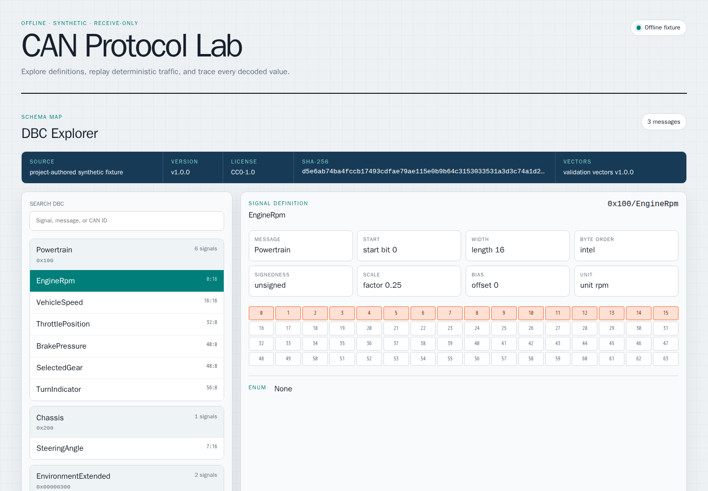
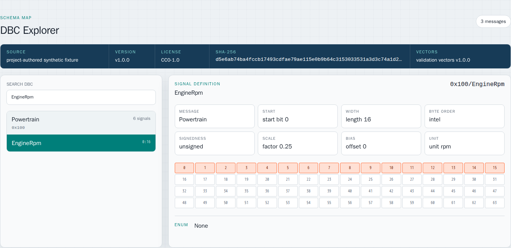
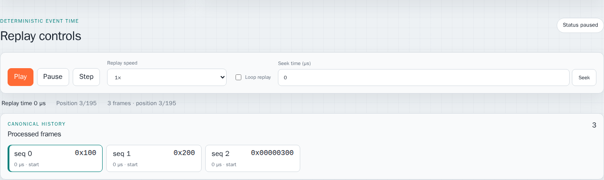
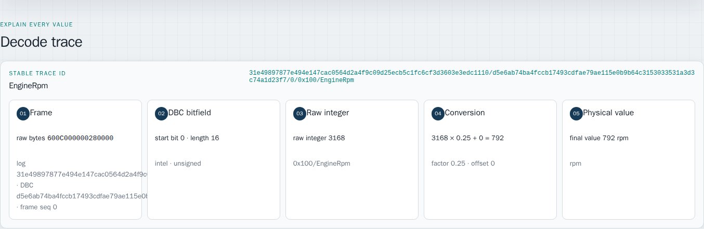
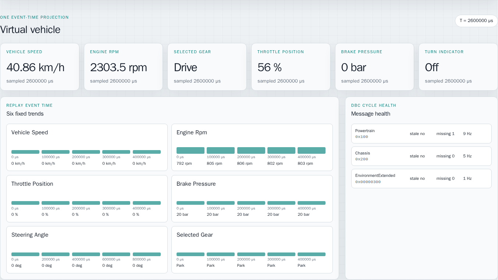
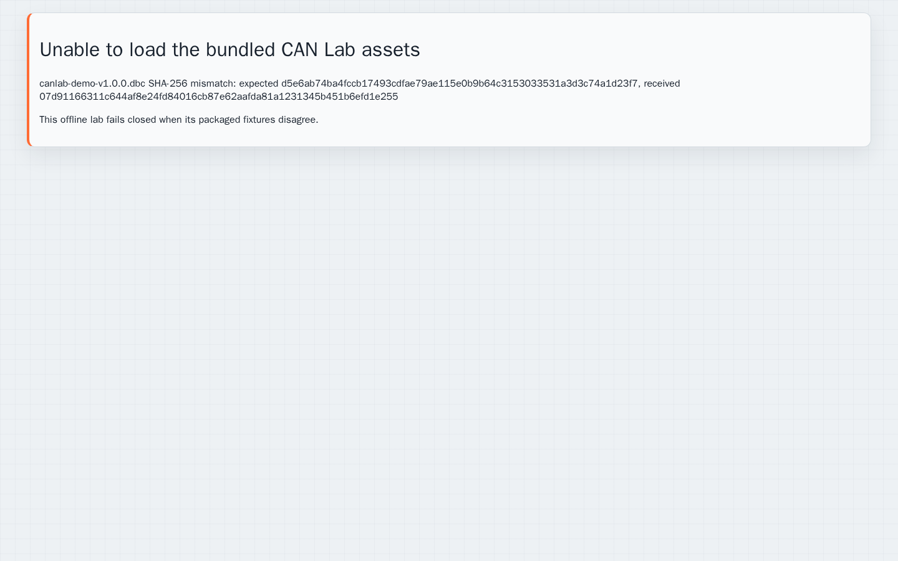

# CAN Lab 中文使用教程

CAN Lab 是一个浏览器内运行的 CAN 协议学习与分析工具。当前版本只使用项目内置的合成 DBC 和确定性 CAN 日志，适合查看信号定义、回放报文、核对解码过程，以及观察虚拟车辆状态。

> 当前能力边界：离线数据、合成数据、只接收分析。它不会连接真实车辆、CAN 硬件或发送 CAN 报文。

## 1. 打开 CAN Lab

本地启动后打开 <http://127.0.0.1:5176/>。需要从同一局域网的其他设备访问时，
使用运行主机的实际 IP 和端口 `5176`。

首次打开后，页面顶部应显示 `CAN Protocol Lab` 和 `Offline fixture`。页面会先校验内置 DBC、验证向量和日志的 SHA-256，全部一致后才显示工作区。



需要自行启动时，在项目根目录执行：

```bash
cd autonomous-driving/canlab
npm ci
npm run dev -- --host 0.0.0.0 --port 5176 --strictPort
```

`0.0.0.0` 使同一局域网中的其他设备可以通过主机 IP 访问。终端退出后服务会停止。

## 2. 查询 DBC 信号定义

页面顶部的 **DBC Explorer** 用于浏览 DBC 中的 Message 和 Signal。

1. 在 `Search DBC` 中输入信号名、消息名或 CAN ID，例如 `EngineRpm`。
2. 在左侧结果中选择 `EngineRpm`。
3. 在右侧检查 Message、起始位、长度、字节序、符号、缩放系数、偏移量和单位。
4. 查看 64-bit 布局；橙色位是当前信号占用的 bit。



图中 `EngineRpm` 的定义是：

| 字段 | 值 |
| --- | --- |
| Message / CAN ID | `Powertrain` / `0x100` |
| Start bit | `0` |
| Length | `16` |
| Byte order | `intel` |
| Signedness | `unsigned` |
| Factor / Offset | `0.25` / `0` |
| Unit | `rpm` |

搜索框只过滤当前内置 DBC，不会访问网络或第三方数据库。

## 3. 回放 CAN 日志

**Replay controls** 按日志中的事件时间回放内置 CAN 帧：

- `Play`：连续播放。
- `Pause`：暂停播放。
- `Step`：处理下一个时间戳组。同一时间戳的帧会作为一组原子处理。
- `Replay speed`：支持 `0.25x`、`0.5x`、`1x`、`2x`、`4x`。
- `Loop replay`：播放到末尾后从头开始。
- `Seek time (µs)`：跳转到指定微秒时间点，并根据该时间点之前的规范历史重建状态。

点击一次 `Step` 后，时间 `0 µs` 的三个报文会一起进入 `Processed frames`。点击其中任意帧，可以把它设为当前待分析帧。



界面中的两个进度值含义如下：

- `Replay time`：当前确定性事件时间，不是电脑的系统时间。
- `Position 3/195`：已经处理 195 帧中的 3 帧。

## 4. 核对信号解码过程

先在 DBC Explorer 中选择信号，再在 `Processed frames` 中选择包含该信号的帧。**Decode trace** 会显示从原始字节到物理值的完整链路：

1. `Frame`：原始 payload、日志摘要、DBC 摘要和帧序号。
2. `DBC bitfield`：起始位、长度、字节序和有无符号。
3. `Raw integer`：从 payload 提取出的原始整数。
4. `Conversion`：DBC 缩放公式。
5. `Physical value`：最终物理值和单位。



图中的计算过程是：

```text
raw bytes 600C000000280000
raw integer 3168
3168 × 0.25 + 0 = 792
final value 792 rpm
```

如果所选帧与所选信号不匹配，界面会显示明确错误或 unknown-frame 信息，不会伪造解码链。

## 5. 查看虚拟车辆与报文健康度

在 `Seek time (µs)` 输入 `2600000`，点击 `Seek`。**Virtual vehicle** 会用 `2,600,000 µs` 及之前的帧重新计算车辆状态。



这个区域包含三类信息：

- 顶部仪表：车速、发动机转速、挡位、油门、制动压力和转向灯。
- `Six fixed trends`：六个固定信号随事件时间变化的样本。
- `Message health`：每个 DBC Message 的 stale、推断丢帧数和频率。

示例截图中：

- 车速为 `40.86 km/h`。
- 发动机转速为 `2303.5 rpm`。
- 挡位为 `Drive`，油门为 `56%`。
- `Powertrain` 推断缺失 `1` 帧，频率为 `9 Hz`。

这些结果都由 Seek 时间点之前的规范帧历史计算，改变播放速度、暂停时长或浏览器执行抖动不会改变同一事件时间的结果。

## 6. 推荐的完整练习

可以按下面的顺序完成一次端到端分析：

1. 搜索并选择 `EngineRpm`。
2. 确认它属于 `Powertrain / 0x100`，占用 bit `0-15`。
3. 点击一次 `Step`。
4. 在 `Processed frames` 中选择 `seq 0 / 0x100`。
5. 在 Decode trace 中核对 `3168 × 0.25 = 792 rpm`。
6. Seek 到 `2600000 µs`。
7. 核对仪表值、趋势和 Message health。
8. 再搜索 `VehicleSpeed`、`SelectedGear` 或 `SteeringAngle`，重复上述过程。

## 7. 完整性错误与排查

如果资源的实际字节与元数据中的 SHA-256 不一致，CAN Lab 会拒绝进入工作区：



这是预期的安全行为，不应跳过摘要校验。按以下顺序排查：

1. 使用 `Ctrl+Shift+R` 强制刷新，确保浏览器没有继续运行旧版本 JavaScript。
2. 确认 DBC、metadata、vectors 和 NDJSON 来自同一次构建，没有单独替换某个文件。
3. 停止并重新启动开发服务。
4. 在项目根目录运行 `npm ci && npm run build`，确认依赖和构建完整。
5. 若仍失败，记录错误中的文件名、expected 摘要和 received 摘要。

旧版本在 LAN 普通 HTTP 下可能显示 `SHA-256 is unavailable in this browser`。当前版本已内置本地 SHA-256 fallback；如果仍看到这条旧错误，说明浏览器或服务仍在使用旧构建，应优先强制刷新并确认服务已重启。

## 8. 验证当前构建

开发者可以执行以下检查：

```bash
npm run lint
npm test
npm run build
npm run boundary:check
```

当前验证基线为 `64` 个测试全部通过。`boundary:check` 用于确认应用仍保持离线、只接收且无硬件发送能力的边界。
