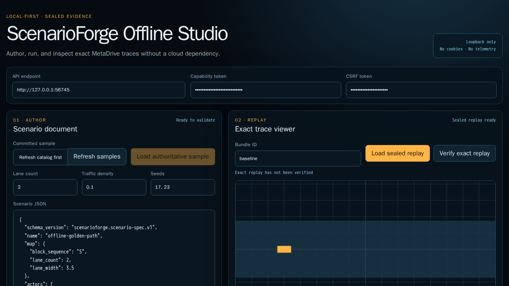
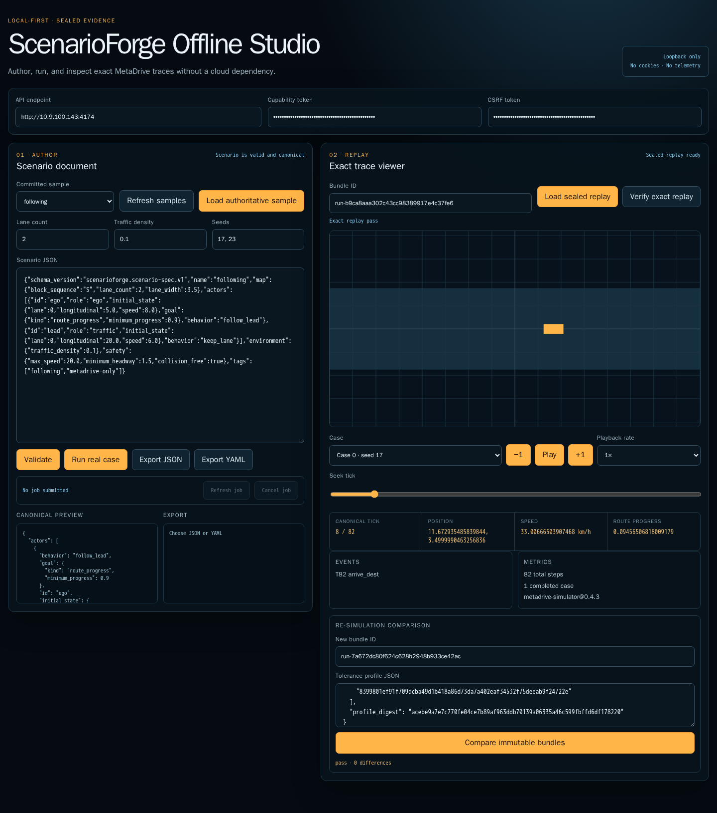
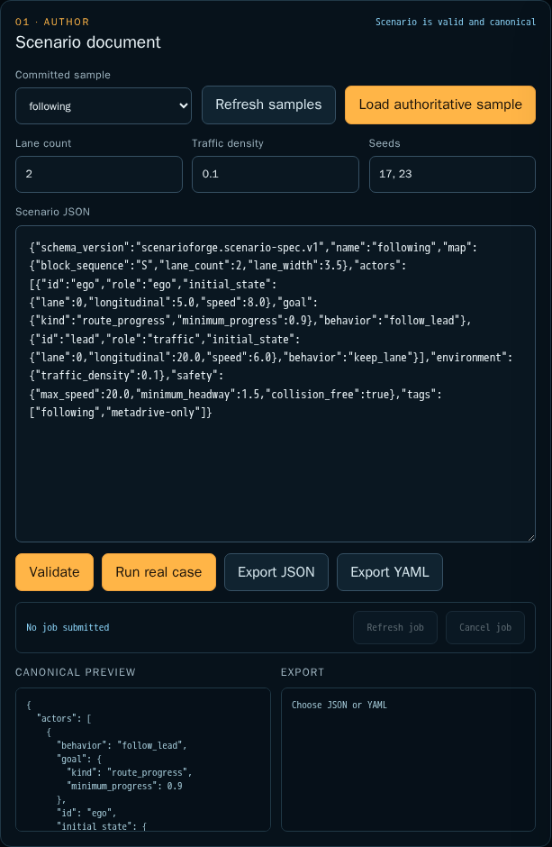
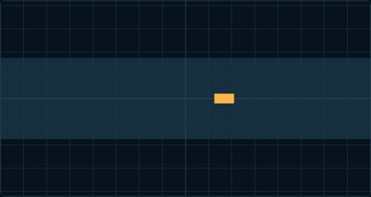
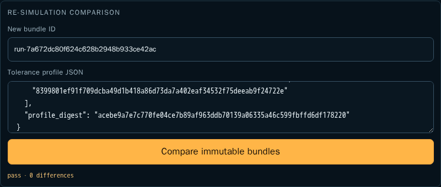

# ScenarioForge 使用教程

## 前车急刹回归资产

`following-emergency-brake` 是已封存的真实 MetaDrive 回归案例：baseline 在 tick 0
处于安全 verdict（无 collision）；candidate 的 `most_dangerous_tick` 是 tick 9，但这不是
碰撞 tick。candidate 在 tick 10 发生 collision 并终止，因而得到 `fail`。两者的 minimum
TTC、lead emergency-brake 触发 tick（baseline 10、candidate 1）及 sealed bundle digest
均写入 `evidence/release/following-emergency-brake/report.json`；candidate 的 tick 9/10
状态可在当前 sealed trace
`evidence/release/following-emergency-brake/web/run-2c30838855ad410ca163448d0bdf7fdd/traces/case-000.json`
回读。Docker Playwright 已通过真实 loopback API 加载两侧 bundle，并封存网络记录与截图：

- `evidence/release/following-emergency-brake/browser/baseline.png`
- `evidence/release/following-emergency-brake/browser/candidate.png`
- `evidence/release/following-emergency-brake/browser/network.json`




这是一条受限的 MetaDrive-only 证据路径，不包含 SMARTS、自动场景搜索或其他未实现行为。

本文介绍如何访问 ScenarioForge Offline Studio，完成场景编辑、校验、真实运行、
密封回放和结果对比。



## 1. 安装并启动

按 [`docs/release/local-install.md`](../release/local-install.md) 安装锁定依赖和通过
allowlist 校验的 MetaDrive assets，然后从项目根目录启动：

```bash
SCENARIOFORGE_CAPABILITY_TOKEN="$(python -c 'import secrets; print(secrets.token_urlsafe(32))')" \
SCENARIOFORGE_CSRF_TOKEN="$(python -c 'import secrets; print(secrets.token_urlsafe(32))')" \
PYTHONPATH=src .venv/bin/python -m scenarioforge.app --host 127.0.0.1 --port 4174
```

打开 <http://127.0.0.1:4174>。如需远程使用，优先通过 SSH 端口转发访问 loopback
服务，不要把能力 token 暴露在公共网络中。

## 2. 填写连接凭据

打开页面后，在顶部 **Local API connection** 区域填写：

1. **API endpoint**：通常已自动设置为当前页面地址。
2. **Capability token**：向本次启动服务的 operator 获取。
3. **CSRF token**：向本次启动服务的 operator 获取。

两个 token 不应写入 URL、源码、截图或 Git。刷新页面后需要重新填写。

它们的职责不同：

- Capability token 保护所有 API 请求。
- CSRF token 额外保护校验、运行、回放和对比等写操作。

## 3. 加载和编辑场景

进入左侧 **Scenario document**：

1. 点击 **Refresh samples**，加载仓库内置样例目录。
2. 在 **Committed sample** 中选择样例。
3. 点击 **Load authoritative sample**。
4. 修改车道数量、交通密度、随机种子或下方 JSON。
5. 点击 **Validate**。

当前内置样例包括：

- `following`
- `merge`
- `lane-conflict`
- `intersection`
- `static-obstacle-avoidance`

成功后状态显示 `Scenario is valid and canonical`，下方 **Canonical preview** 会显示
规范化后的场景及其摘要。

JSON 不合法或违反场景 schema 时，页面会显示带字段位置的诊断信息。应先修复诊断，
再执行真实运行。

下图是本次实测加载 `following` 并通过 canonical 校验后的页面：



## 4. 导出规范化场景

场景校验通过后，可以使用：

- **Export JSON**：导出规范化 JSON。
- **Export YAML**：导出规范化 YAML。

导出结果显示在左侧 **Export** 区域。导出不会启动 MetaDrive。

## 5. 运行真实 MetaDrive 场景

在 **Seeds** 中填写一个或多个非负整数，例如：

```text
17, 23
```

然后：

1. 点击 **Validate** 确认场景有效。
2. 点击 **Run real case**。
3. 记录页面返回的 job ID。
4. 点击 **Refresh job** 查看异步任务状态。
5. 如需中止，点击 **Cancel job**。

真实运行需要已安装并通过 allowlist 校验的 MetaDrive 0.4.3 assets。assets 缺失、摘要
不匹配或运行资源超过限制时，任务会失败，不会在运行时自动下载资源。

## 6. 查看密封回放

右侧 **Exact trace viewer** 默认可以使用内置 bundle：

```text
bundle
```

操作步骤：

1. 在 **Bundle ID** 输入 bundle 名称。
2. 点击 **Load sealed replay**。
3. 点击 **Verify exact replay** 验证密封清单和回放一致性。
4. 使用 **Case** 切换不同 seed 的运行结果。
5. 使用 `-1`、**Play/Pause**、`+1`、进度条和播放倍率检查轨迹。

页面会同步显示：

- 当前 tick
- 车辆位置
- 速度
- 路线进度
- 运行事件
- 汇总指标
- MetaDrive provider 版本

Three.js 画布只读取密封运行轨迹；查看回放不会再次启动 MetaDrive，也不会访问外部
网络。

下图来自真实运行 R1 的 tick 8，不是合成演示帧：



## 7. 对比两次运行

在 **Re-simulation comparison** 中：

1. 当前 **Bundle ID** 作为基线。
2. 在 **New bundle ID** 输入候选 bundle。
3. 在 **Tolerance profile JSON** 填写容差策略。
4. 点击 **Compare immutable bundles**。

页面会返回：

- `pass`：候选结果满足精确项和数值容差。
- `regression`：发现超出容差的差异。
- `incompatible`：两个 bundle 无法按同一合同进行比较。

本次 R1 与 R6 的实际页面对比结果如下：



## 8. 本次真实数据 A/B 验证

以下数据于 2026-08-09 在当前 R4 代码上实际运行产生。六次运行均启动独立
MetaDrive worker，不使用 synthetic success：

- 场景：`following`
- Seed：`17`
- Provider：`metadrive-simulator@0.4.3`
- Python：`3.11.15`
- 执行类型：`real-metadrive`
- 外部网络：`denied`
- 自动下载：`false`
- Scenario digest：`be217550ef56d1cec7b18a90fb8ae32d90a2a591809f68496c80225bb32d9011`
- Case config digest：`ee542d91be01fc2b19b6ff5f827497480293e7ded687f7b005f18b4ba14c1094`
- Asset lock digest：`fa5e3e4972c4bd1ff0b05e7efd7d8447efc832e582a77ff22cf1381b8a4fa1d0`

### 六次真实运行结果

| 运行 | Bundle ID | Wall ms | CPU ms | Peak RSS MiB | Steps | 模拟秒数 | Route progress | 终止原因 | Verdict |
| --- | --- | ---: | ---: | ---: | ---: | ---: | ---: | --- | --- |
| R1 | `run-b9ca8aaa...` | 2023 | 2405 | 284.6 | 82 | 8.2 | 0.965570539 | `arrive_dest` | `pass` |
| R2 | `run-2e09399f...` | 2050 | 2432 | 285.6 | 82 | 8.2 | 0.965570539 | `arrive_dest` | `pass` |
| R3 | `run-c21abccc...` | 1786 | 2168 | 285.6 | 82 | 8.2 | 0.965570539 | `arrive_dest` | `pass` |
| R4 | `run-9b72f7a2...` | 1796 | 2178 | 285.6 | 82 | 8.2 | 0.965570539 | `arrive_dest` | `pass` |
| R5 | `run-743d3938...` | 2024 | 2407 | 284.6 | 82 | 8.2 | 0.965570539 | `arrive_dest` | `pass` |
| R6 | `run-7a672dc8...` | 1404 | 1786 | 283.9 | 82 | 8.2 | 0.965570539 | `arrive_dest` | `pass` |

Wall time、CPU time 和 RSS 会随主机调度产生波动，因此不作为语义一致性的直接判断项。
六次运行的 steps、模拟时间、路线进度、终止原因、碰撞、越界和 verdict 完全一致。

### 校准与候选对比

R1-R5 用于生成五次运行校准 profile，R6 作为独立候选：

```text
profile digest:
acebe9a7e7c770fe04ce7b89af963ddb70139a06335a46c599fbffd6df178220

route_progress tolerance: 1e-9
simulated_seconds tolerance: 1e-9
```

对比结果：

```json
{
  "status": "pass",
  "baseline_bundle_id": "run-b9ca8aaa302c43cc98389917e4c37fe6",
  "candidate_bundle_id": "run-7a672dc80f624c628b2948b933ce42ac",
  "incompatibilities": [],
  "exact_differences": [],
  "numeric_differences": []
}
```

密封摘要：

```text
R1 manifest: 06b5f253912188e70959000c586dffcd15e6de0460523c7d2bb1e8237e31c702
R6 manifest: 3f601b36787ad3372969f3d0f4fcf1dab0c2dcbc39f0ef7c6b0e03aeda87e573
```

本机原始证据位于：

```text
evidence/web/live-r4-bundles/run-b9ca8aaa302c43cc98389917e4c37fe6/
evidence/web/live-r4-bundles/run-7a672dc80f624c628b2948b933ce42ac/
evidence/web/live-r4-bundles/tolerance-profile.json
```

可以使用同一 oracle 再次验证：

```bash
.venv/bin/scenarioforge compare \
  --baseline evidence/web/live-r4-bundles/run-b9ca8aaa302c43cc98389917e4c37fe6 \
  --candidate evidence/web/live-r4-bundles/run-7a672dc80f624c628b2948b933ce42ac \
  --profile evidence/web/live-r4-bundles/tolerance-profile.json
```

## 9. 常用 CLI

以下命令从仓库根目录执行：

```bash
# 查看内置样例目录
.venv/bin/scenarioforge samples list

# 校验场景文件
.venv/bin/scenarioforge validate samples/following.json

# 验证一个密封回放 bundle
.venv/bin/scenarioforge replay verify \
  --bundle evidence/runtime/metadrive-smoke/bundle
```

如果未安装 entry point，可以显式指定源码目录：

```bash
PYTHONPATH=src .venv/bin/python -m scenarioforge.app samples list
```

## 10. 官方本地安全模式

正式本地使用仍推荐 loopback 模式：

```bash
SCENARIOFORGE_CAPABILITY_TOKEN="$(python -c 'import secrets; print(secrets.token_urlsafe(32))')" \
SCENARIOFORGE_CSRF_TOKEN="$(python -c 'import secrets; print(secrets.token_urlsafe(32))')" \
PYTHONPATH=src .venv/bin/python -m scenarioforge.app \
  --host 127.0.0.1 \
  --port 4174
```

远程浏览器需要正式使用时，优先通过 SSH tunnel 保留 loopback 安全边界：

```bash
ssh -L 4174:127.0.0.1:4174 <user>@<server-ip>
```

随后在本地浏览器打开 `http://127.0.0.1:4174`。

当前 `0.0.0.0:4174` 入口用于受信网络内的产品预览，不应直接暴露到公网。

## 11. 常见问题

### 页面能打开，但按钮操作失败

检查 API endpoint、Capability token 和 CSRF token。浏览器刷新后 token 不会保留。

### `capability authentication failed`

Capability token 不正确，重新向启动服务的 operator 获取。

### `CSRF verification failed`

CSRF token 不正确。GET 类操作可能正常，但校验、运行和回放操作会被拒绝。

### `request origin is not allowed`

当前浏览器入口与服务允许的 origin 不一致。不要混用服务器 IP、`localhost` 和
`127.0.0.1`；使用启动时给出的完整地址。

### `bundle not found`

Bundle ID 是配置的 bundle root 下的目录名，不是任意文件系统绝对路径。

### MetaDrive 任务启动失败

先检查 MetaDrive assets、`libgl1`、Python 3.11 以及锁定依赖是否已安装：

```bash
uv sync --frozen --all-groups
npm --prefix web ci
npm --prefix web run build
```

完整安装和 assets 校验过程见 [local-install.md](../release/local-install.md)。

## 12. 停止服务

停止本次预览：

```bash
tmux kill-session -t scenarioforge-r4-final
```

停止后确认端口已释放：

```bash
ss -ltnp | rg ':4174|:4176' || true
```
