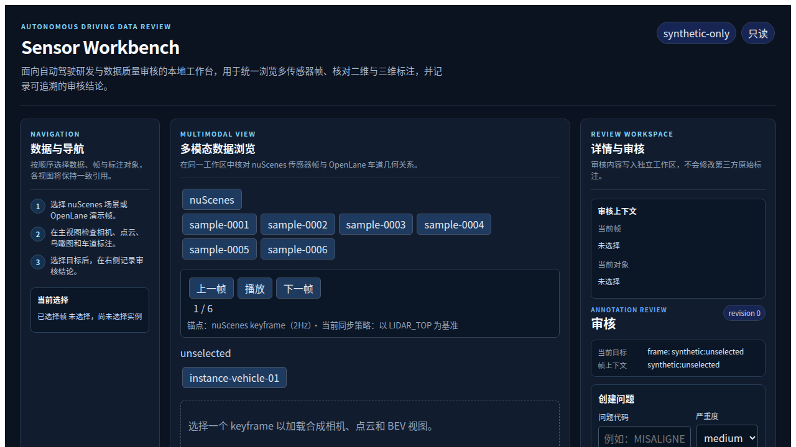

# Sensor Workbench 中文使用教程

Sensor Workbench 默认使用仓库内的合成 fixture，因此首次启动不需要下载 nuScenes 或
OpenLane，也不会向外网发送请求。真实数据模式见最后一节。

## 1. 启动工作台

在项目根目录执行：

```bash
npm ci --prefix app
npm run dev
```

打开 <http://127.0.0.1:4173/>。页面标题为 **Sensor Workbench**，左侧是数据适配器和
多模态浏览区，中间是场景/车道内容，右侧是 **Review** 审核面板。



若只想验证生产构建：

```bash
npm run build
npm run preview -- --host 127.0.0.1 --port 4173
```

## 2. 浏览 nuScenes 合成 keyframe

1. 在 nuScenes 区域选择一个 frame，例如 `sample-0002`。
2. 检查 `frame_context_id`、时间戳和传感器时间差。
3. 在实例列表选择车辆目标。
4. 查看六路相机、LiDAR 点云和 BEV 中是否保持相同的实例引用。

合成视图用于演示交互和契约，不代表 nuScenes 原始媒体。切换 frame 后，过期的异步
响应不会覆盖当前上下文。

## 3. 浏览 OpenLane 2D/3D lane

1. 在 OpenLane 面板选择一条 lane。
2. 同时查看 2D reference、3D reference、类别、点序列、可见性和属性。
3. 注意面板中的只读审计状态：第三方数据根摘要在浏览前后应保持一致。

合成 fixture 中的 lane 只用于解析和联动测试，不包含 OpenLane 原始图片或标注压缩包。

## 4. 创建并导入审核差异

1. 在右侧 Review 面板填写问题代码和评论。
2. 点击 **创建问题**，观察审核历史中的新记录。
3. 点击 **导出差异**，复制生成的 JSON。
4. 将 JSON 粘贴到导入框并点击 **导入差异**。
5. 重复导入同一份差异，系统应显示重复数量而不是创建第二条记录。

审核状态写入浏览器工作区，不会修改第三方数据目录。导出的差异不包含原始媒体和绝对
路径。

## 5. 真实本地数据

真实数据由使用者自行准备并承担许可证责任。启动前设置数据根：

```bash
export NUSCENES_DATA_ROOT=/path/to/nuscenes
export OPENLANE_DATA_ROOT=/path/to/openlane
npm run dev
```

应用只接受 loopback 请求并以只读方式扫描数据根；不支持符号链接逃逸、路径穿越、跨站
写请求或把数据上传到远端。nuScenes 读取 `v1.0-mini` 元数据和 keyframe 资产；OpenLane
读取项目支持的 V1.2 annotation/image 结构。数据缺失或版本不兼容时，界面会保留合成演示
或显示明确的本地数据不可用状态。

## 6. 开发者验证

```bash
npm run typecheck
npm run build
npm --prefix app run test:unit
npm --prefix app run e2e:synthetic
npm run verify:license
```

资源受限的机器可使用：

```bash
CHOKIDAR_USEPOLLING=1 npm --prefix app run e2e:synthetic
```

## 7. 范围和限制

当前版本不提供在线模型推理、训练、OpenLane 官方评测、远程多用户协作、HD Map、CAN
总线接入或车辆控制。它是本地研究、评测和演示工具，不构成安全认证或生产部署建议。
